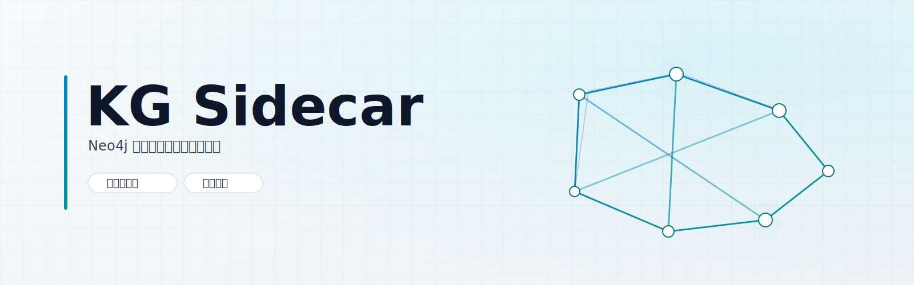

# KG Sidecar

[](https://github.com/ZUENS2020/kg-sidecar/releases)
[](LICENSE)
[](https://github.com/ZUENS2020/kg-sidecar)
[](scripts/kg-sidecar-realnet-regression.js)

KG Sidecar 是一个为 SillyTavern 准备的“动态语义知识图谱”插件实现，目标是让多轮对话的关系记忆可持续、可追踪、可审计。

## 你会得到什么

- 六槽位流水线：Retriever / Injector / Extractor / Judge / Historian（Actor 复用 ST 主模型）
- 强一致提交与回滚语义（失败不脏写）
- Neo4j 图谱写入与会话级数据库绑定
- 里程碑时间线与快照回溯
- 实网长对话回归脚本（20 轮）

## 目录结构

- `public/scripts/extensions/kg-sidecar/` 前端扩展
- `src/endpoints/kg-sidecar.js` API 路由
- `src/sidecar/kg/` sidecar 核心逻辑
- `scripts/kg-sidecar-realnet-regression.js` 实网回归脚本
- `docs/architecture/` 与 `docs/operations/` 运行文档
- `tests/` 插件相关测试

## 安装到 SillyTavern

把本仓库内容合并到你的 SillyTavern 根目录后，确认 `src/server-startup.js` 中有以下两处：

1. import：

```js
import { router as kgSidecarRouter } from './endpoints/kg-sidecar.js';
```

2. 路由注册：

```js
app.use('/api/kg-sidecar', kgSidecarRouter);
```

然后重启 SillyTavern。

## 快速安装脚本

### PowerShell（Windows）

```powershell
$repo = "https://github.com/ZUENS2020/kg-sidecar.git"
$stRoot = "J:\SillyTavern"
$tmp = Join-Path $env:TEMP ("kg-sidecar-install-" + [Guid]::NewGuid().ToString("N"))

git clone --depth 1 $repo $tmp

Copy-Item -Recurse -Force "$tmp\public\scripts\extensions\kg-sidecar" "$stRoot\public\scripts\extensions\"
Copy-Item -Force "$tmp\src\endpoints\kg-sidecar.js" "$stRoot\src\endpoints\"
Copy-Item -Recurse -Force "$tmp\src\sidecar\kg" "$stRoot\src\sidecar\"
Copy-Item -Force "$tmp\scripts\kg-sidecar-realnet-regression.js" "$stRoot\scripts\"

Write-Host "请确认 src/server-startup.js 已注册 /api/kg-sidecar 路由，然后重启 SillyTavern。"
```

### Bash（Linux/macOS）

```bash
REPO="https://github.com/ZUENS2020/kg-sidecar.git"
ST_ROOT="$HOME/SillyTavern"
TMP_DIR="$(mktemp -d)"

git clone --depth 1 "$REPO" "$TMP_DIR"

cp -rf "$TMP_DIR/public/scripts/extensions/kg-sidecar" "$ST_ROOT/public/scripts/extensions/"
cp -f "$TMP_DIR/src/endpoints/kg-sidecar.js" "$ST_ROOT/src/endpoints/"
cp -rf "$TMP_DIR/src/sidecar/kg" "$ST_ROOT/src/sidecar/"
cp -f "$TMP_DIR/scripts/kg-sidecar-realnet-regression.js" "$ST_ROOT/scripts/"

echo "请确认 src/server-startup.js 已注册 /api/kg-sidecar 路由，然后重启 SillyTavern。"
```

## 使用

1. 打开扩展面板，启用 `KG Sidecar`。
2. 选择图存储（Neo4j 或 memory），填写连接信息。
3. 配置各槽位模型（支持 OpenRouter 模型列表）。
4. 开始对话，观察状态、图谱与里程碑。

## 实网回归

在 SillyTavern 运行状态下执行：

```bash
node scripts/kg-sidecar-realnet-regression.js
```

会自动输出报告到 `output/kg-sidecar-realnet-regression-*.json`。

## 说明

- 本项目遵循 AGPL-3.0（见 `LICENSE`）。
- 推荐在测试环境先完成回归后再用于长期会话。
