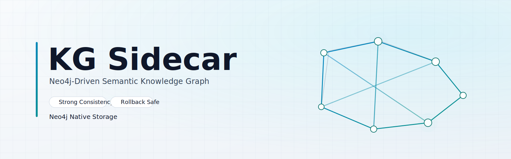

<p align="center">
  
</p>

# KG Sidecar（SillyTavern 动态语义知识图谱插件）

面向 SillyTavern 的侧车式知识图谱插件。目标是让“人物关系 + 关键事件”在多轮对话中持续可检索、可注入、可审计、可回放。

## 项目定位

本插件采用**侧车总线编排（推荐）**：
- 主聊天仍由 SillyTavern 现有聊天链路负责（Actor 不在插件里单独配置）。
- KG Sidecar 在每轮前后完成检索、记忆注入、关系审计与图谱写入。
- 支持强一致模式，提交失败会回滚并返回失败阶段与原因码。

## 核心思路

1. 检索：从 Neo4j 召回焦点人物、关系与关键事件。
2. 注入：把召回结果重构为混合视角记忆包（你 / 他人关系 / 中立背景 / 事件证据）。
3. 主聊：主模型基于注入后的上下文生成回复。
4. 审计更新：Extractor 执行 Evolve / Replace / Delete，Judge 做身份一致性裁决，Historian 产出剧情里程碑。
5. 图谱同步：写入 Neo4j 并保留时序信息，支持后续检索与可视化。

## 当前实现特性

- 六槽位流水线：Retriever / Injector / Actor / Extractor / Judge / Historian。
- 强一致提交门：任一关键槽位输出无效会回滚，不做本地语义兜底。
- 关系三动作：
  - Evolve：同关系累加强度。
  - Replace：关系类型质变替换。
  - Delete：关系删除（阈值与衰减协同）。
- 事件图模型：
  - 人物节点（KGEntity）：`id/name=人物名`，带 `bio` 简介。
  - 关系边（KG_REL）：`label/status/name` 表示关系，`weight` 表示强度。
  - 事件节点（KGEvent）：`event_key` 唯一，`event_id/id/name=事件名`。
  - 参与关系（INVOLVES）：一个事件可关联多人物，一个人物可关联多事件。
- 近期修复：
  - 事件名归一化：自动将模板名（如 `事件:EVOLVE:A→B`）纠偏为真实事件名（如“霜火协定”）。
  - 人物/事件分离约束：问“哪些人”时抑制把事件名当人物。

## 实现方法与技术细节

### 1) 槽位路由与模型
- 模型路由来自插件配置，支持与 SillyTavern API 提供商/模型列表同步。
- 严格模式下，信息提取相关步骤必须走 LLM（OpenRouter）；不使用本地语义规则兜底。

### 2) 提取器（Extractor）
- 输入：当前轮消息、对话窗口、已有关系、关系提示、焦点实体。
- 输出：结构化 `actions + global_audit`。
- 内置事件名标准化逻辑：优先保留显式事件名；若是模板事件名则从证据文本抽取真实事件标题。

### 3) 注入器（Injector）
- 输出固定四段：
  - `second_person_psychology`
  - `third_person_relations`
  - `neutral_background`
  - `event_evidence_context`
- 事件证据上下文显式分为“人物实体 / 事件实体 / 证据行”，降低实体混淆。

### 4) 图存储（Neo4j）
- 关系与事件分层建模，支持按人物回查关键事件。
- 事件节点写入 `id/name=事件名`，便于图上直读。
- 提供清库接口、会话绑定数据库配置与可切换 profile。

### 5) 事务与回滚
- 提交门会校验 Extractor/Judge/Historian 输出合法性。
- 任一阶段失败返回 `ROLLED_BACK`，包含 `failed_stage` 与 `reason_code`。

## 目录结构

- `public/scripts/extensions/kg-sidecar/`：前端扩展（设置页、样式、模型刷新等）
- `src/sidecar/kg/`：侧车服务与槽位实现
- `src/endpoints/kg-sidecar.js`：服务端接入端点
- `docs/architecture/`：运行架构说明
- `docs/operations/`：运维与回归脚本说明

## 安装与接入（详细步骤）

下面是**源码覆盖安装**（当前最直接、最稳定）的方式。

### 0) 前置条件

- 已有可运行的 SillyTavern（建议与本插件同一主版本阶段）。
- Node.js / npm 可用（用于启动 ST）。
- 必须有可连接的 Neo4j 实例（本机或服务器），并可访问 Bolt 端口（默认 `7687`）。
- 已准备好 LLM API（推荐 OpenRouter），并已在 ST 内可正常对话。

### 1) 备份你的 SillyTavern

至少备份这些目录/文件：
- `public/scripts/extensions/`
- `src/`
- `data/`（尤其是 `data/default-user/settings.json`）

如果你用 Git 管理 ST，建议先打一个提交点：

```bash
git add -A
git commit -m "backup before kg-sidecar install"
```

### 2) 把插件代码覆盖到 ST 根目录

将本仓库内容按同名路径复制到 ST 根目录。最少必须存在：
- `public/scripts/extensions/kg-sidecar/*`
- `src/sidecar/kg/*`
- `src/endpoints/kg-sidecar.js`

Windows（PowerShell）示例：

```powershell
$Plugin = "D:\kg-sidecar"      # 插件仓库路径
$ST = "D:\SillyTavern"         # SillyTavern 根目录

Copy-Item "$Plugin\public\scripts\extensions\kg-sidecar" "$ST\public\scripts\extensions\" -Recurse -Force
Copy-Item "$Plugin\src\sidecar\kg" "$ST\src\sidecar\" -Recurse -Force
Copy-Item "$Plugin\src\endpoints\kg-sidecar.js" "$ST\src\endpoints\" -Force
```

Linux/macOS 示例：

```bash
PLUGIN=/opt/kg-sidecar
ST=/opt/SillyTavern

cp -r "$PLUGIN/public/scripts/extensions/kg-sidecar" "$ST/public/scripts/extensions/"
cp -r "$PLUGIN/src/sidecar/kg" "$ST/src/sidecar/"
cp "$PLUGIN/src/endpoints/kg-sidecar.js" "$ST/src/endpoints/"
```

### 3) 重启 SillyTavern

在 ST 根目录执行：

```bash
npm start
```

启动后，打开 ST 页面，确认扩展列表中出现 `KG Sidecar` 设置区。

### 4) 启动 Neo4j（必需；若你已在运行可跳过本步骤）

Docker 示例：

```bash
docker run -d --name neo4j-mapped \
  -p 7474:7474 -p 7687:7687 \
  -e NEO4J_AUTH=neo4j/Neo4jPass_2026! \
  neo4j:latest
```

然后在插件设置中填：
- URI: `bolt://127.0.0.1:7687`
- Database: `neo4j`
- Username: `neo4j`
- Password: 你的密码

### 5) 在 ST 中完成插件配置

1. 打开扩展设置 `KG Sidecar`。  
2. 勾选启用 Sidecar Pipeline。  
3. 配置 Neo4j 连接信息。  
4. 刷新并选择槽位模型（Retriever/Injector/Extractor/Judge/Historian）。  
5. 主聊天模型仍在 ST 的 API 页面配置（不要在插件内重复配置 Actor）。  
6. 建议开启强一致（失败即回滚，便于排错）。  

### 6) 联通验证（建议按顺序）

1. 发送一句带显式事件名的话，例如：  
   `昨夜在北境并肩作战，事件名是“晨星誓约”，参与者是我和艾琳。`
2. 再问：  
   `晨星誓约涉及哪些人？只回答人名。`
3. 预期：  
   - sidecar commit 返回 `COMMITTED`  
   - Neo4j 中 `KGEvent.event_id/id/name` 为 `晨星誓约`  
   - 回复中不把“晨星誓约”当人物名  

### 7) 升级与回滚

- 升级：重复第 2 步覆盖并重启 ST。  
- 回滚：恢复第 1 步备份，或在 Git 中切回备份提交。  

## 配置建议

- 主聊天模型：在 SillyTavern API 页面正常配置（不在插件里重复配置 Actor）。
- 槽位模型：建议先统一同一模型做稳定性验证，再分槽位调优。
- 图存储：仅支持 Neo4j（强制）。
- 强一致：建议开启；超时/格式错误直接报错并回滚。

## 验证清单

1. 连续对话 10~20 轮，观察关系权重是否连续演进。
2. 明确命名事件后，检查 KGEvent 是否写入 `event_id/id/name=事件名`。
3. 提问“涉及哪些人”，确认回复不把事件名当人物。
4. 检查 sidecar 返回是否包含 `milestones`、`global_audit`、`graph_delta`。

## License

AGPL-3.0
